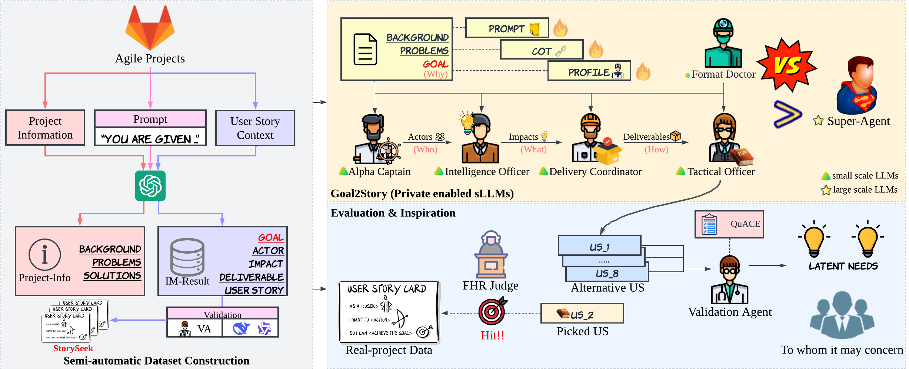

# Goal2Story

## Project Overview



This is the repository for the Goal2Story project proposed in the paper *Goal2Story: A Multi-Agents Fleet based on Privately Enabled sLLMs for Impacting Mapping on Requirements Elicitation*. Goal2Story is a project designed to implement goal-driven requirements elicitation using a multi-agents fleet with small LLMs. The project involves experiments with different models and techniques to improve the quality and reliability of generated user stories. The evaluation is conducted using metrics such as Factual Hit Rate (FHR) and Custom Quality User Story (CQUS). The dataset of this project is from [StorySeek](https://huggingface.co/datasets/SoftACE/StorySeek) and the dataset is used for the evaluation of the project and further research and industry applications.

** StorySeek Dataset: **: <https://huggingface.co/datasets/SoftACE/StorySeek>

## Directory Structure

- **`goal2story/`**: Contains the main implementation files for the Goal2Story project.
  - `goal2story.py`: Core implementation of the Goal2Story model.
  - `goal2story_cot.py`: Implementation with Chain of Thought (CoT) features.
  - `goal2story_profile.py`: Implementation with profiling features.

- **`super-agent/`**: Contains the implementation of the Super-Agent model.
  - `super-agent.py`: Main script for the Super-Agent model.

- **`evaluation/`**: Contains scripts and data for evaluating the models.
  - `result_json_parser.py`: Parses JSON results for analysis.
  - `cqus/`: Contains scripts and prompts for CQUS evaluation.
    - `validation-agent.py`: Script for validating user stories.
    - `cqus_prompt.txt`: Prompt used for CQUS evaluation.
    - `cqus4dataset_prompt.txt`: Dataset-specific CQUS prompt.
  - `fhr/`: Contains scripts for FHR evaluation.
    - `calc_similarity.py`: Calculates similarity metrics for FHR.

- **`prompts/`**: Contains prompt templates used in the project.
  - `single_agent_prompt.txt`: Prompt for single agent scenarios.
  - `userstory_prompt.txt`: Prompt for generating user stories.
  - `deliverable_prompt.txt`: Prompt for deliverable generation.
  - `impact_prompt.txt`: Prompt for impact analysis.
  - `actor_prompt.txt`: Prompt for actor identification.

- **`prompts_cot/`**: Contains prompt templates with Chain of Thought (CoT) features.
  - Similar to `prompts/` but with CoT enhancements.

- **`dataset/`**: Directory intended for storing datasets used in the project.

- **`requirements.txt`**: Lists the Python dependencies required to run the project.

## How to Run

1. **Install Dependencies**: Ensure you have Python installed, then install the required packages using:
   ```bash
   pip install -r requirements.txt
   ```
2. **Set up environment variables**: Set the environment variables for the project.
3. **Run Goal2Story**: Execute the main script to generate user stories:
   ```bash
   python goal2story/goal2story.py
   ```

4. **Evaluate Models**: Use the evaluation scripts to assess the quality of generated user stories:
   - For FHR evaluation:
     ```bash
     python evaluation/fhr/calc_similarity.py
     ```
   - For CQUS evaluation:
     ```bash
     python evaluation/cqus/validation-agent.py
     ```

5. **Run Super-Agent**: Execute the Super-Agent script for comparison:
   ```bash
   python super-agent/super-agent.py
   ```

